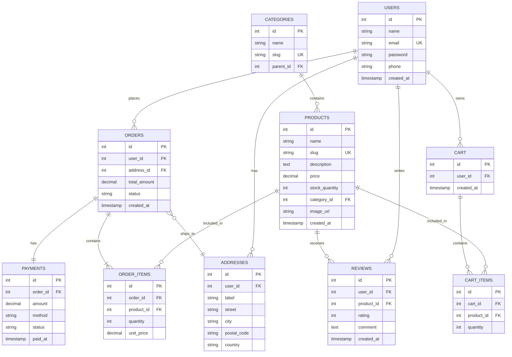

# E-commerce Database Design

```mermaid
erDiagram
    USERS ||--o{ ORDERS : places
    USERS ||--o{ REVIEWS : writes
    USERS ||--o{ CART : owns
    USERS ||--o{ ADDRESSES : has

    CATEGORIES ||--o{ PRODUCTS : contains
    PRODUCTS ||--o{ ORDER_ITEMS : included_in
    PRODUCTS ||--o{ CART_ITEMS : included_in
    PRODUCTS ||--o{ REVIEWS : receives

    ORDERS ||--|{ ORDER_ITEMS : contains
    ORDERS ||--|| PAYMENTS : has
    ORDERS }o--|| ADDRESSES : ships_to

    CART ||--o{ CART_ITEMS : contains

    USERS {
        int id PK
        string name
        string email UK
        string password
        string phone
        timestamp created_at
    }

    CATEGORIES {
        int id PK
        string name
        string slug UK
        int parent_id FK
    }

    PRODUCTS {
        int id PK
        string name
        string slug UK
        text description
        decimal price
        int stock_quantity
        int category_id FK
        string image_url
        timestamp created_at
    }

    ORDERS {
        int id PK
        int user_id FK
        int address_id FK
        decimal total_amount
        string status
        timestamp created_at
    }

    ORDER_ITEMS {
        int id PK
        int order_id FK
        int product_id FK
        int quantity
        decimal unit_price
    }

    CART {
        int id PK
        int user_id FK
        timestamp created_at
    }

    CART_ITEMS {
        int id PK
        int cart_id FK
        int product_id FK
        int quantity
    }

    PAYMENTS {
        int id PK
        int order_id FK
        decimal amount
        string method
        string status
        timestamp paid_at
    }

    ADDRESSES {
        int id PK
        int user_id FK
        string label
        string street
        string city
        string postal_code
        string country
    }

    REVIEWS {
        int id PK
        int user_id FK
        int product_id FK
        int rating
        text comment
        timestamp created_at
    }
```